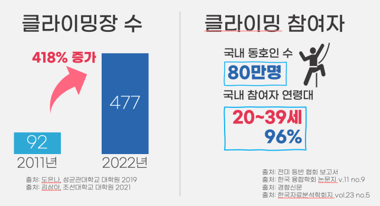
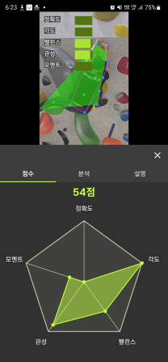

# 링크

## [홈페이지](https://www.climb-balance.com)

## [웹 데모](https://app.climb-balance.com)

웹 버전에서는 많은 기능이 빠져 있습니다.  
모바일에서는 잘 작동 하지 않습니다.   
가급적 PC로 접속해 주세요.
Guest 접속 코드는 `somauser`입니다.

## [플레이스토어](https://play.google.com/store/apps/details?id=com.climb_balance.app)

아직 검토 중 이여서 연결 되지 않을 수 있습니다.

# 소개

## 목적 및 필요성

- 클라이밍은 신규 종목으로써 년대 이후 빠르게 성장해왔다.
- 그러나 빠른 성장으로 인해 다양한 문제점들이 존재한다.
- 본 서비스는 그중 주요한 3가지 문제점에 주목하여 본 서비스를 통해 해당 문제점을 해결하려 한다.
- 또한 클라이밍 시장의 성장에 기여하고자 한다.

### 해결하고자 하는 문제

#### 문제점1. 자세 교정의 어려움

- 클라이밍은 피지컬(근력)과 테크닉(동작) 두 가지 요소가 조화롭게 필요한 운동이다.
- 피지컬은 클라이밍을 계속하거나 단순 반복을 통해 자연스레 성장한다.
- 그러나 테크닉은 클라이머가 의식하며 자신의 자세를 교정해야만 한다.
- **주변인의 도움을 받기에는 산체 조건의 차이 때문에 제대로 된 조언을 받을 수 없다.**

#### 문제점2. 영상의 지속성 부족

- 앞에서 언급한 자세 교정의 어려움을 해결하기 위해 혹은 자신의 영상을 자랑하기 위해 많은 클라이머들은 삼각대로 본인의 영상을 찍는다.
- 그러나 이 후에 영상들은 방치되며 용량만 차지하거나 알아보기가 어렵게 된다.
- 다시 되짚어 보거나 남의 영상을 보아도 썸네일이 비슷해 구분하기가 어렵다.

#### 문제점3. 소통 공간의 부재

- 기존 클라이밍 커뮤니티는 전부 활성화에 처참하게 실패했다.
- 클라이밍 참여자는 앞서 말했듯 계속 증가 추세이지만 아직 커뮤니티가 존재하지 않는다.
- 폐쇄적이고 파편화된 커뮤니티가 주를 이룬다.
- 입문자들에게 낯설 수 밖에 없으며, 정보를 얻기 힘든 구조이다.

## 문제 해결 및 경쟁 분석

### 기획 의도 및 해결 방법

#### 1. 시간과 공간에 제한 없는 피드백 => 인공지능 피드백과 사용자 피드백

- 인공지능 피드백은 사용자의 클라이밍 영상을 인공지능으로 분석해 점수화하고 취약한 부분에 대한 조언을 주는 기능이다.
- 위치 인식 인공지능으로 영상에서 사람의 위치를 찾고, 관절 인식 인공지능으로 관절의 위치를 찾는다.
- 그 데이터를 토대로 다양한 물리학적 기준과 클라이밍 이론적 기준을 바탕으로 클라이밍 자세를 평가한다.
- 위치 인식 훈련을 위해서는 공개 데이터셋 사진 67000장과 직접 수집하고 라벨링한 클라이밍 사진 8355장을 기존 모델에 fine-tuning해 학습했다.
  
- 위치 인식 연산량을 줄이기 위해서 프레임을 조금씩 건너뛰며 우선 처리해 변화가 크지 않다면 그 사이를 선형적으로 이어주는 기법을 사용했다. **(연산량 80% 이상 절약)**
- 관절 인식 역시 클라이밍 데이터셋을 직접 제작해 find-tuning했으며, 벽에 사람이 붙어있음을 고려해 물리적으로 움직일 수 없는 신체 부위를 필터링해 정확도를 높였다.

- 평가에 대한 지표는 다음과 같다.  
  
- 자세 평가 인공지능에 대한 평가는 클라이밍에 대한 다양한 이해도를 지닌 모집단에게 테스트를 통해 평가받았다. 모집단은 클라이밍 강사(남녀), 클라이밍 동호인(남녀), 클라이밍 입문자(남녀)로 이루어져
  있다.

- 인공지능 서버 비용의 경우 배치 처리와 AWS 딥러닝 가속 칩, 그리고 Lambda를 이용한 비용 절감을 통해 **1분짜리 AI 영상 처리 당 비용을 25원** 수준으로 절감시켰다.

#### 2. 클라이밍 일기

- 클라이밍 영상에 난이도, 날짜, 장소, 성공 여부에 대한 태그를 설정하고 간단한 설명을 적어 마치 일기처럼 사용할 수 있다.
- 매우 많은 클라이밍 영상들 사이에서 헤매던 클라이머들을 위해 태그 기능을 통해 자신이 원하는 영상만을 골라볼 수 있도록 하였다.
- 추후 타인에게 공개되면 SNS처럼 운용할 수 있게할 예정이다.
- 현재도 AI 분석 영상과 일반 영상을 외부로 공유할 수 있어, 자연스런 사용자의 홍보를 유도하고 있다.

#### 3. 클라이머의 소통 공간

- 영상 스트리밍을 통한 커뮤니티이며 어플리케이션을 통해 서비스되기에 영상의 트래픽을 고려해봐야했다.
- hls 스트리밍을 사용해 2가지 화질로 인코딩된 영상에 동적으로 접급하게 함으로써 유저의 네트워크 환경을 고려했다.
- 또한 영상의 용량을 줄이기 위해 최신 스마트폰 기준 15Mbps의 비트레이트로 촬영되는 영상을 실험을 통해 1.5Mbps까지 낮췄다.
  
- 클라이밍 영상은 비교적 정적이기에 비트레이트를 공격적으로 낮출 수 있음을 파악했고, 비트레이트를 낮춰  **용량을 90% 절감시킬 수 있었다.**

- 유튜브 숏츠나 틱톡과 같은 숏폼 플랫폼으로 타 클라이머들의 영상을 볼 수 있다.
- 이곳에서 여러 클라이머들의 다양한 의견을 받아 객관적인 시각으로 자신을 되돌아 볼 수 있다.
- 또한 다른 클라이머들에게 자신의 의견을 자유롭게 달 수 있는 소통의 기회를 제공한다.

### 시장 및 경쟁사 분석

#### 시장 소비자 동향 분석

- 클라이밍 시장은 앞에서 언급했듯 꾸준한 성장세를 보이고 있다.
- 국내 클라이밍 센터의 수는 2011년 92개에서 2022년 477개로  **418% 증가**해왔는데, 이는 국내 클라이밍의 시장과 소비자의 성장세를 가장 잘 보여주고 있다.
- 주목할만한 점은 **국내 참여자 연령대의 96%가 20~39세**라는 점이다.
- 이들은 구매력이 있으며 **구독 경제에 익숙한 연령층**이므로 본 서비스의 비즈니스 모델이 잘 안착할 수 있을 것으로 기대한다.

#### 경쟁사 분석

- 앞에서도 언급했듯이, 클라이밍은 현 시장 규모에 비해 관련 소프트웨어 서비스가 사실상 없다고 해도 무방한 수준이다.
- 클라이밍 관련 사이트들을 만드려는 시도가 없었던 것은 아니지만 모두가 활성화에 실패하고 방치되거나, 다른 방식으로 생존을 도모하고 있다.

- 이들이 실패한 원인은 낮은 개발 완성도와 서비스를 단순 커뮤니티 차원에서만 접근하고 BM을 광고에 의존했기 때문이라고 파악했다.
- 그렇기에 본 서비스는 **BM을 다양화(정액제, 영상 광고, 수수료 등)**할 것이다.
- 또한 **AI 자세 분석, 영상 일기, 클라이밍 영상 시청, 강습 매칭** 등의 기능을 추가해 반복적인 사용에 대한 이유를 제공하고자 했다.

## 기대 효과 및 활용 방안

### 비즈니스 모델

- 프리미엄 AI 분석 기능을 위한 구독 요금제
- 클라이밍 용품, 클라이밍장 등 관련 업체 광고
- 강습 매칭 후 업체로부터 받는 수수료

### 사업화 계획

- 현재 **국내 클라이밍 유튜버 구독자 수 1위 '클라임 투어 티비'와 자문 및 홍보 협의 진행** 중에 있음.
  
- 현직 클라이밍장 강사에게 자문 및 협의 진행중
  

### 홍보

- 인스타그램을 통한 지속적 홍보 진행 중

### 기대 효과

- 클라이밍에 존재하지 않던 통합된 커뮤니티의 역활을 수행할 수 있다.
- 클라이밍 영상 일기를 시작으로 영상 SNS와 같은 형태로 나아가 종합 운동 영상 플랫폼으로 발전해 나갈 수 있음.
- AI 자세 분석의 경우 비슷한 타 운동으로 발전해 나갈 수 있다.
- 결국 클라임밸런스의 최종 목표는 **운동 계의 틱톡, 밴드**이다.
